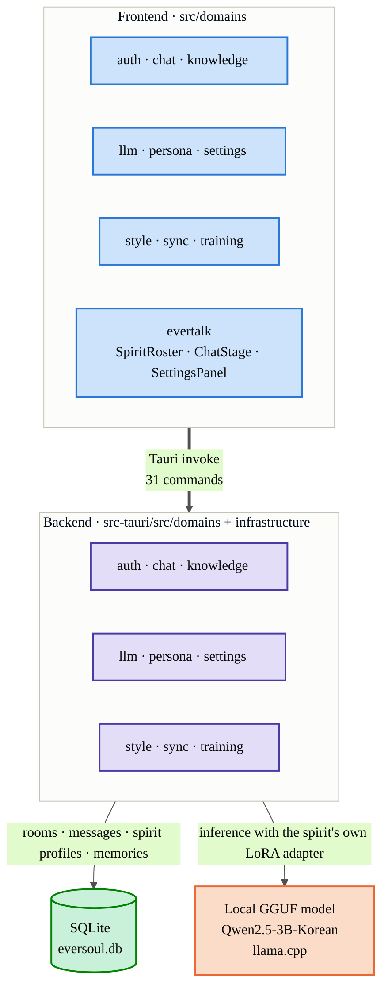

<p align="right">
  <a href="README.md"> 한국어</a> &nbsp;|&nbsp;
   <strong>English</strong> &nbsp;|&nbsp;
  <a href="README.zh-CN.md"> 简体中文</a>
</p>

<p align="center">
  
</p>

<h1 align="center">EverSoul AI Chat</h1>
<p align="center"><i>A fully local AI chat client that carries the voices of the spirits</i></p>

<p align="center">
  
  
  
  
  
  
  
  
  
</p>

---

## 🌟 Overview

**EverSoul AI Chat** is a new local AI chat project made to keep EverSoul close. It was built with one idea in mind: preserving the memories of the spirits. It brings all 95 spirits from EverSoul to life using the real game data, so you can talk with each of them in their own personality and voice.

The AI that generates every reply runs entirely on your own computer. Nothing you say ever leaves your machine — every conversation with a spirit stays local, start to finish.

That's why the full official artwork of all 95 spirits, 522 conversation backgrounds, and the UI that EverTalk itself used are all bundled directly into this project. Each spirit's name, personality, and speech patterns are organized one file at a time under `data/personas/`, prepared in Korean, English, and Chinese (Traditional/Simplified) in advance — so switching languages never breaks what makes that spirit feel like itself.

<p align="center">
  
  
  
  
  
  
</p>

---

## 🎨 Full Spirit Gallery (95 Spirits)

A complete gallery built by looking through all 95 `data/personas/*.json` files, listing each spirit's artwork alongside its real Korean (ko), English (en), and Simplified Chinese (zh_cn) names exactly as stored in the data. The artwork folder names are taken exactly the way `resolveSpiritAssetFolder` in `src/domains/persona/logic.ts` looks them up (26 spirits whose in-game display name differs from their actual artwork folder name follow the `explicitAssetFolders` mapping as-is).

<table>
<tr>
<td align="center"><br/><sub>아야메<br/>Ayame<br/>綾織</sub></td>
<td align="center"><br/><sub>아야메(츠쿠요미)<br/>Ayame (Tsukuyomi)<br/>綾織（月讀）</sub></td>
<td align="center"><br/><sub>아키<br/>Aki<br/>秋</sub></td>
<td align="center"><br/><sub>알리샤<br/>Alisha<br/>艾麗西雅</sub></td>
<td align="center"><br/><sub>아드리안<br/>Adrianne<br/>阿德里安</sub></td>
<td align="center"><br/><sub>아이라<br/>Aira<br/>艾拉</sub></td>
<td align="center"><br/><sub>클라우디아(대천사)<br/>Claudia (Archangel)<br/>克勞迪婭（大天使）</sub></td>
<td align="center"><br/><sub>클레르<br/>Claire<br/>克萊兒</sub></td>
</tr>
<tr>
<td align="center"><br/><sub>셰리<br/>Cherrie<br/>雪莉</sub></td>
<td align="center"><br/><sub>클로이<br/>Chloe<br/>克羅伊</sub></td>
<td align="center"><br/><sub>셰리(낭만)<br/>Cherrie (Romantic)<br/>雪莉（浪漫）</sub></td>
<td align="center"><br/><sub>클라라<br/>Clara<br/>克拉拉</sub></td>
<td align="center"><br/><sub>클라우디아<br/>Claudia<br/>克勞迪婭</sub></td>
<td align="center"><br/><sub>가넷<br/>Garnet<br/>佳妮特</sub></td>
<td align="center"><br/><sub>캐서린(광휘)<br/>Catherine (Radiance)<br/>凱瑟琳（光輝）</sub></td>
<td align="center"><br/><sub>도미니크<br/>Dominique<br/>多米尼克</sub></td>
</tr>
<tr>
<td align="center"><br/><sub>에일린<br/>Eileen<br/>艾琳</sub></td>
<td align="center"><br/><sub>이나<br/>Ina<br/>伊娜</sub></td>
<td align="center"><br/><sub>헤이즐<br/>Hazel<br/>黑伊茲爾</sub></td>
<td align="center"><br/><sub>캐서린<br/>Catherine<br/>凱瑟琳</sub></td>
<td align="center"><br/><sub>도라<br/>Dora<br/>朵菈</sub></td>
<td align="center"><br/><sub>가넷(열락)<br/>Garnet (Rapture)<br/>佳妮特（狂喜）</sub></td>
<td align="center"><br/><sub>홍란<br/>Honglan<br/>紅蘭</sub></td>
<td align="center"><br/><sub>한울<br/>Hanul<br/>韓羽</sub></td>
</tr>
<tr>
<td align="center"><br/><sub>이디스<br/>Edith<br/>伊迪絲</sub></td>
<td align="center"><br/><sub>플린<br/>Flynn<br/>弗林</sub></td>
<td align="center"><br/><sub>에루샤<br/>Erusha<br/>艾魯莎</sub></td>
<td align="center"><br/><sub>홍란(무쌍)<br/>Honglan (Peerless)<br/>紅蘭（無雙）</sub></td>
<td align="center"><br/><sub>에리카<br/>Erika<br/>艾麗卡</sub></td>
<td align="center"><br/><sub>하루(카무이)<br/>Haru (Kamuy)<br/>河路（神威）</sub></td>
<td align="center"><br/><sub>카넬리안<br/>Carnelian<br/>卡內莉安</sub></td>
<td align="center"><br/><sub>카렌<br/>Karen<br/>卡倫</sub></td>
</tr>
<tr>
<td align="center"><br/><sub>조앤<br/>Joanne<br/>瓊</sub></td>
<td align="center"><br/><sub>다프네<br/>Daphne<br/>達芙妮</sub></td>
<td align="center"><br/><sub>이브<br/>Eve<br/>夏娃</sub></td>
<td align="center"><br/><sub>제이드<br/>Jade<br/>潔依德</sub></td>
<td align="center"><br/><sub>토키사키 쿠루미<br/>Kurumi Tokisaki<br/>時崎狂三</sub></td>
<td align="center"><br/><sub>재클린<br/>Jacqueline<br/>潔克琳</sub></td>
<td align="center"><br/><sub>라리마<br/>Larimar<br/>拉利瑪</sub></td>
<td align="center"><br/><sub>하루<br/>Haru<br/>河路</sub></td>
</tr>
<tr>
<td align="center"><br/><sub>지호<br/>Jiho<br/>智河</sub></td>
<td align="center"><br/><sub>르웨인<br/>Lewayne<br/>樂溫</sub></td>
<td align="center"><br/><sub>브라이스<br/>Bryce<br/>布萊斯</sub></td>
<td align="center"><br/><sub>칸나<br/>Kanna<br/>坎納</sub></td>
<td align="center"><br/><sub>지호(미르)<br/>Jiho (Mir)<br/>智河（米爾）</sub></td>
<td align="center"><br/><sub>벨레드<br/>Beleth<br/>貝萊德</sub></td>
<td align="center"><br/><sub>린지<br/>Linzy<br/>琳賽</sub></td>
<td align="center"><br/><sub>라우라<br/>Laura<br/>蘿拉</sub></td>
</tr>
<tr>
<td align="center"><br/><sub>린지(타나토스)<br/>Linzy (Thanatos)<br/>琳賽（桑納托斯）</sub></td>
<td align="center"><br/><sub>릴리트<br/>Lilith<br/>莉莉絲</sub></td>
<td align="center"><br/><sub>리젤로테<br/>Lizelotte<br/>莉澤洛特</sub></td>
<td align="center"><br/><sub>루테<br/>Lute<br/>魯特</sub></td>
<td align="center"><br/><sub>마농<br/>Manon<br/>瑪儂</sub></td>
<td align="center"><br/><sub>멜피스<br/>Melfice<br/>梅爾菲斯</sub></td>
<td align="center"><br/><sub>메피스토펠레스<br/>Mephistopheles<br/>梅菲斯托佩萊斯</sub></td>
<td align="center"><br/><sub>메릴<br/>Meryl<br/>梅莉兒</sub></td>
</tr>
<tr>
<td align="center"><br/><sub>미카<br/>Mica<br/>米卡</sub></td>
<td align="center"><br/><sub>메피스토펠레스(여명)<br/>Mephistopheles (Dawn)<br/>梅菲斯托佩萊斯（黎明）</sub></td>
<td align="center"><br/><sub>미리암<br/>Miriam<br/>米里昂</sub></td>
<td align="center"><br/><sub>무명<br/>Nameless<br/>無名</sub></td>
<td align="center"><br/><sub>나이아<br/>Naiah<br/>娜伊雅</sub></td>
<td align="center"><br/><sub>나오미<br/>Naomi<br/>直美</sub></td>
<td align="center"><br/><sub>미리암(잔영)<br/>Miriam (Afterimage)<br/>米里昂（殘影）</sub></td>
<td align="center"><br/><sub>니콜<br/>Nicole<br/>妮可</sub></td>
</tr>
<tr>
<td align="center"><br/><sub>니아<br/>Nia<br/>妮亞</sub></td>
<td align="center"><br/><sub>오닉스<br/>Onyx<br/>歐妮絲</sub></td>
<td align="center"><br/><sub>니니<br/>Nini<br/>妮妮</sub></td>
<td align="center"><br/><sub>오토하<br/>Otoha<br/>乙葉</sub></td>
<td align="center"><br/><sub>페트라(각혼)<br/>Petra (Awakened Soul)<br/>佩特拉（覺魂）</sub></td>
<td align="center"><br/><sub>레베카<br/>Rebecca<br/>瑞貝卡</sub></td>
<td align="center"><br/><sub>로제<br/>Rose<br/>蘿絲</sub></td>
<td align="center"><br/><sub>르네<br/>Renee<br/>勒內</sub></td>
</tr>
<tr>
<td align="center"><br/><sub>리타<br/>Rita<br/>麗塔</sub></td>
<td align="center"><br/><sub>로제(홍염)<br/>Rose (Prominence)<br/>蘿絲（紅焰）</sub></td>
<td align="center"><br/><sub>르네(백은)<br/>Renee (Argent)<br/>勒內（白銀）</sub></td>
<td align="center"><br/><sub>타샤<br/>Tasha<br/>塔莎</sub></td>
<td align="center"><br/><sub>페트라<br/>Petra<br/>佩特拉</sub></td>
<td align="center"><br/><sub>프림<br/>Prim<br/>弗里姆</sub></td>
<td align="center"><br/><sub>사쿠요(업화)<br/>Sakuyo (Inferno)<br/>櫻世（業火）</sub></td>
<td align="center"><br/><sub>순이<br/>Soonie<br/>順伊</sub></td>
</tr>
<tr>
<td align="center"><br/><sub>샤링<br/>Sharinne<br/>夏琳</sub></td>
<td align="center"><br/><sub>비올레트<br/>Violette<br/>薇奧蕾特</sub></td>
<td align="center"><br/><sub>야토가미 토카<br/>Tohka Yatogami<br/>夜刀神十香</sub></td>
<td align="center"><br/><sub>탈리아<br/>Talia<br/>塔利亞</sub></td>
<td align="center"><br/><sub>시그리드<br/>Sigrid<br/>希格莉德</sub></td>
<td align="center"><br/><sub>시하<br/>Seeha<br/>西荷</sub></td>
<td align="center"><br/><sub>루리<br/>Ruri<br/>魯莉</sub></td>
<td align="center"><br/><sub>바이스<br/>Weiss<br/>拜斯</sub></td>
</tr>
<tr>
<td align="center"><br/><sub>벨라나<br/>Velanna<br/>貝拉納</sub></td>
<td align="center"><br/><sub>비비안<br/>Vivienne<br/>薇薇安</sub></td>
<td align="center"><br/><sub>소연<br/>Xiaolian<br/>小蓮</sub></td>
<td align="center"><br/><sub>유리아<br/>Yuria<br/>尤里婭</sub></td>
<td align="center"><br/><sub>사쿠요<br/>Sakuyo<br/>櫻世</sub></td>
<td align="center"><br/><sub>유리아(아폴리온)<br/>Yuria (Apollyon)<br/>尤里婭（阿巴頓）</sub></td>
<td align="center"><br/><sub>웨리<br/>Wheri<br/>威里</sub></td>
<td></td>
</tr>
</table>

Each spirit's artwork doesn't stop at a single picture. It's split across folders — `base` (everyday look), `costume`, `raid`, `gacha`, `srg` — so the same spirit has several different pictures on hand.

<p align="center">
  
  
  
  
</p>
<p align="center"><sub>What's in Adrianne's folder — from left, base, costume, gacha, raid</sub></p>

---

## 🚀 Key Features

- 💻 **AI that runs on your computer alone**: Built on `llama.cpp`, generating replies without a GPU. Threads are sized to your CPU's physical core count, so it stays stable without overloading your machine.
- 🎭 **95 spirits, each with their own personality**: Name, grade, race, class, voice actor, birthday, likes — everything organized per spirit gets loaded and assembled so every spirit speaks like themselves.
- 🧠 **A spirit that remembers talking with you**: After every exchange, the spirit checks itself for anything worth remembering and keeps it. Those memories get re-summarized from time to time, so the spirit carries them into the next conversation too.
- 🌐 **Switch languages, the spirit stays the same**: Names, introductions, and speech patterns are all ready in Korean, English, and Chinese (Traditional/Simplified), so changing the app language instantly changes the spirit's name and introduction too.
- 🧬 **Fine-tuning that makes a spirit more itself over time**: A Qwen2 model built from scratch in pure Rust (`candle`), no Python involved — you can run local fine-tuning (LoRA) right on your own machine, trained on that spirit's own conversations.
- 📂 **Everything stays on your computer**: Conversations, spirit profiles, and speech-pattern settings all stay in a lightweight SQLite database.
- 🖼️ **Backgrounds stay too**: All 522 official EverSoul illustration backgrounds are ready to pull up and change the mood of the conversation whenever you like.

<p align="center">
  
  
  
  
  
  
</p>

---

## 🏗 Architecture

The React frontend and Rust backend are structured as symmetric domain modules of the same name, communicating exclusively through Tauri IPC (`invoke`).



- **Local DB path**: `database/eversoul.db` under the OS app-data directory (reset on every launch in debug builds).
- **Settings file**: `config/settings.ini` under the app-data directory (read/written via `rust-ini`; stores default spirit, active style, and language).
- **LoRA adapter storage**: `lora_adapters/` under the app-data directory (per-spirit fine-tuning results kept isolated).

More detailed diagrams — the spirit-data build pipeline, the conversation sequence, the LoRA training flow, and the database structure — are in [docs/ARCHITECTURE.en.md](docs/ARCHITECTURE.en.md).

---

## 🛠 Tech Stack

### Frontend Stack
- **Framework**: `React 19.1` + `TypeScript 6.0` + `Vite 8`
- **State Management**: `TanStack React Query v5` (async server state), `Zustand v5` (global client state)
- **Styling**: `Tailwind CSS v4` (`@tailwindcss/vite`) + `clsx` (class composition)
- **Icons**: `lucide-react`
- **Tauri Plugins**: `@tauri-apps/plugin-dialog`, `plugin-fs`, `plugin-opener`, `plugin-shell`

### Desktop Runtime & Backend Stack
- **Core Runtime**: `Tauri v2` (Rust 2021 edition); release builds are optimized with `codegen-units=1` + `lto=true` + `opt-level=3` + `panic=abort` + `strip`.
- **Local Database**: `SQLite3` (`rusqlite` bundled)
- **HTTP Client**: `reqwest` (rustls, json, stream features)
- **AI Inference Engine**: `llama.cpp` (`llama-cpp-2` C-bindings, GGUF format) + `num_cpus` (physical-core-based thread sizing)
- **On-device Fine-tuning**: `candle-core` / `candle-nn` 0.8 (Qwen2 architecture + hand-built LoRA adapter), `hf-hub`, `tokenizers` (BPE, `onig` feature)
- **Serialization / Utilities**: `serde`, `serde_json`, `anyhow`, `thiserror`, `tracing` + `tracing-subscriber`, `uuid`, `directories`, `sha2`, `hex`, `flate2`, `rust-ini`

---

## 📦 Local Model

A single fixed model is used for high-quality Korean performance. The shipped build already includes this model, so there's nothing extra to download.

- **Name**: `MyeongHo0621/Qwen2.5-3B-Korean Q4_K_M`
- **Location**: `ai/model/qwen25-3b-korean-Q4_K_M.gguf`

---

## 💻 Run & Build Guide

### Build Prerequisites
To build the local LLM inference binding (`llama-cpp-2`), the following tools must be installed beforehand.
- [Visual Studio Build Tools](https://visualstudio.microsoft.com/downloads/) (including the C++ compiler)
- [CMake](https://cmake.org/download/) (version 3.20 or later)
- [Clang](https://releases.llvm.org/download.html) (C/C++ parser for Bindgen)

### Install Dependencies
```bash
npm install
```

### Run in Development Mode
```bash
npm run tauri dev
```

### Production Build
```bash
npm run tauri build
```

---

## 🧩 Spirit (Persona) Data Schema

Spirits fall into seven races (`race`).

<table>
<tr>
<td align="center"><br/><sub>Beast</sub></td>
<td align="center"><br/><sub>Human</sub></td>
<td align="center"><br/><sub>Elf</sub></td>
<td align="center"><br/><sub>Undead</sub></td>
<td align="center"><br/><sub>Chaos</sub></td>
<td align="center"><br/><sub>Angel</sub></td>
<td align="center"><br/><sub>Demon</sub></td>
</tr>
</table>

When the app is actually chatting, it reads a spirit's name, personality, and speech patterns from the SQLite `persona_profile.raw_json` column. Every time the spirit list is queried, `PersonaService::get_available_personas` reloads it from `personas.bin` and upserts it into that column, and the system prompt actually sent to the LLM is assembled by `PersonaService::build_localized_system_prompt` parsing that same `raw_json`.

The source of that data is the 95 `data/personas/*.json` files. `tools/build_complete_personas.cjs` normalizes them into the 4-language array (`LANGUAGES = ['ko', 'en', 'zh_tw', 'zh_cn']`) and builds them into `personas.bin`. Below is the real field structure of one of those source files (Adrianne's).

```json
{
  "id": "5020",
  "name": "아드리안",
  "name_en": "Adrianne",
  "grade": "에픽",
  "race": "천사형",
  "class": "디펜더",
  "sub_class": "광역",
  "stat": "힘",
  "profile": {
    "nick_name": "정의의 빛",
    "constellation": "천칭자리",
    "union": "에델 가드",
    "birthday": "1017",
    "height": 167,
    "weight": 51,
    "cv_ko": "이명호",
    "cv_jp": "Eri Kitamura",
    "like": ["강아지", "감동 실화"],
    "dislike": ["범죄", "악인"],
    "hobby": ["영지 순찰"],
    "speciality": ["멋진 포즈 연구"]
  },
  "personality": { "description": "...", "greeting": "..." },
  "speech_patterns": ["...", "..."],
  "i18n": {
    "name": { "ko": "아드리안", "en": "Adrianne", "zh_tw": "阿德里安", "zh_cn": "阿德里安" },
    "grade": { "ko": "에픽", "en": "Epic", "zh_tw": "史詩", "zh_cn": "史詩" },
    "race": { "ko": "천사형", "en": "Angel", "zh_tw": "天使型", "zh_cn": "天使型" },
    "class": { "ko": "디펜더", "en": "Defender", "zh_tw": "捍衛者", "zh_cn": "捍衛者" },
    "profile": {
      "nick_name": { "ko": "정의의 빛", "en": "Light of Justice", "zh_tw": "正義之光", "zh_cn": "正義之光" },
      "constellation": { "ko": "천칭자리", "en": "Libra", "zh_tw": "天秤座", "zh_cn": "天秤座" }
    }
  }
}
```

- The `i18n` block is a **field-first structure**: each field name is the key, and beneath it sit the 4 language values `{ ko, en, zh_tw, zh_cn }`. Translations exist down to the individual field level for `name` · `grade` · `race` · `class` · `sub_class` · `stat`, as well as `profile.nick_name` · `profile.constellation` · `profile.union` · `profile.cv_ko` · `profile.cv_jp` · `profile.like` · `profile.dislike` · `profile.hobby` · `profile.speciality`.
- For display, `parseSpiritDetail` in `src/domains/persona/logic.ts` parses this same `raw_json` and picks the right language. The system prompt actually sent to the LLM is assembled separately — the Rust backend's `PersonaService::build_localized_system_prompt` re-parses `raw_json` on its own — but both ultimately read from SQLite's `raw_json`.
- Each spirit's artwork lives under `public/eversoul-assets/spirits/{EnglishName}/`, split into category folders: `base` (base illustration at 512/1024/2048), `costume`, `gacha`, `raid`, and `srg` (story). The `LoadableAssetImage` component (`src/domains/evertalk/components/LoadableAssetImage.tsx`) tries a list of candidate paths in order (`useFirstLoadableImage`) and renders the first one that actually loads.

---

## 📌 Versioning Rule

This repository follows the principle of **incrementing the patch version by 1 for every commit**. The `version` field in `package.json`, `src-tauri/Cargo.toml`, and `src-tauri/tauri.conf.json` must always stay in sync, and all three files are updated together whenever a commit containing a functional change is created.

| Version | Commit |
| --- | --- |
| 0.0.1 | `first` |
| 0.0.2 | `초기세팅` |
| 0.0.3 | `초기세팅2` |
| 0.0.4 | `초기세팅3` |
| 0.0.5 | `초기셋팅4` |
| 0.0.6 | `update_i18n : en , kr , zh_tw , zh_cn` |
| 0.0.7 | Trilingual README overhaul + versioning rule documentation |
| 0.0.7 | `up` |
| 0.0.8 | `bugfix` |
| 0.0.9 | `up` |

---

## 📄 License

This project is licensed under the **Apache License 2.0**.
GGUF Model (`Qwen2.5-3B-Korean`) is created by `MyeongHo0621` and distributed under **Apache License 2.0**.
