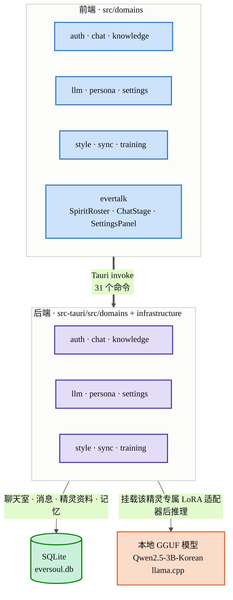

<p align="right">
  <a href="README.md"> 한국어</a> &nbsp;|&nbsp;
  <a href="README.en.md"> English</a> &nbsp;|&nbsp;
   <strong>简体中文</strong>
</p>

<p align="center">
  
</p>

<h1 align="center">EverSoul AI Chat</h1>
<p align="center"><i>承载精灵之声的完全本地化 AI 聊天客户端</i></p>

<p align="center">
  
  
  
  
  
  
  
  
  
</p>

---

## 🌟 概述

**EverSoul AI Chat** 是为了留住《EverSoul》而做的全新本地 AI 聊天项目，怀着保存精灵们记忆的心意做成。它让《EverSoul》的全部 95 名精灵，用游戏中的真实数据活过来，让你能和每一位精灵以各自的性格与语气自由交谈。

生成每一句回复的 AI 完全在你自己的电脑里运行。你说的任何话都不会离开这台机器——和精灵的每一次对话，从头到尾都只留在本地。

正因如此，全部 95 名精灵的官方原画、522 张对话背景，以及 EverTalk 本身用过的界面，都被直接打包进了这个项目里。每位精灵的名字、性格与语录都按精灵逐一整理在 `data/personas/` 之下，并提前准备好了韩语、英语、中文（繁体/简体）版本——换语言的时候，那位精灵之所以是那位精灵的东西不会跟着变。

<p align="center">
  
  
  
  
  
  
</p>

---

## 🎨 全体精灵图鉴（95 名）

通过扫描全部 95 个 `data/personas/*.json` 文件构建的完整图鉴，按数据原文如实列出每位精灵的原画及其韩语（ko）、英语（en）、简体中文（zh_cn）名称。素材文件夹名称的解析方式与 `src/domains/persona/logic.ts` 中的 `resolveSpiritAssetFolder` 完全一致（游戏内显示名称与实际图片文件夹名称不同的 26 名精灵，直接套用 `explicitAssetFolders` 映射表）。

<table>
<tr>
<td align="center"><br/><sub>아야메<br/>Ayame<br/>綾織</sub></td>
<td align="center"><br/><sub>아야메(츠쿠요미)<br/>Ayame (Tsukuyomi)<br/>綾織（月讀）</sub></td>
<td align="center"><br/><sub>아키<br/>Aki<br/>秋</sub></td>
<td align="center"><br/><sub>알리샤<br/>Alisha<br/>艾麗西雅</sub></td>
<td align="center"><br/><sub>아드리안<br/>Adrianne<br/>阿德里安</sub></td>
<td align="center"><br/><sub>아이라<br/>Aira<br/>艾拉</sub></td>
<td align="center"><br/><sub>클라우디아(대천사)<br/>Claudia (Archangel)<br/>克勞迪婭（大天使）</sub></td>
<td align="center"><br/><sub>클레르<br/>Claire<br/>克萊兒</sub></td>
</tr>
<tr>
<td align="center"><br/><sub>셰리<br/>Cherrie<br/>雪莉</sub></td>
<td align="center"><br/><sub>클로이<br/>Chloe<br/>克羅伊</sub></td>
<td align="center"><br/><sub>셰리(낭만)<br/>Cherrie (Romantic)<br/>雪莉（浪漫）</sub></td>
<td align="center"><br/><sub>클라라<br/>Clara<br/>克拉拉</sub></td>
<td align="center"><br/><sub>클라우디아<br/>Claudia<br/>克勞迪婭</sub></td>
<td align="center"><br/><sub>가넷<br/>Garnet<br/>佳妮特</sub></td>
<td align="center"><br/><sub>캐서린(광휘)<br/>Catherine (Radiance)<br/>凱瑟琳（光輝）</sub></td>
<td align="center"><br/><sub>도미니크<br/>Dominique<br/>多米尼克</sub></td>
</tr>
<tr>
<td align="center"><br/><sub>에일린<br/>Eileen<br/>艾琳</sub></td>
<td align="center"><br/><sub>이나<br/>Ina<br/>伊娜</sub></td>
<td align="center"><br/><sub>헤이즐<br/>Hazel<br/>黑伊茲爾</sub></td>
<td align="center"><br/><sub>캐서린<br/>Catherine<br/>凱瑟琳</sub></td>
<td align="center"><br/><sub>도라<br/>Dora<br/>朵菈</sub></td>
<td align="center"><br/><sub>가넷(열락)<br/>Garnet (Rapture)<br/>佳妮特（狂喜）</sub></td>
<td align="center"><br/><sub>홍란<br/>Honglan<br/>紅蘭</sub></td>
<td align="center"><br/><sub>한울<br/>Hanul<br/>韓羽</sub></td>
</tr>
<tr>
<td align="center"><br/><sub>이디스<br/>Edith<br/>伊迪絲</sub></td>
<td align="center"><br/><sub>플린<br/>Flynn<br/>弗林</sub></td>
<td align="center"><br/><sub>에루샤<br/>Erusha<br/>艾魯莎</sub></td>
<td align="center"><br/><sub>홍란(무쌍)<br/>Honglan (Peerless)<br/>紅蘭（無雙）</sub></td>
<td align="center"><br/><sub>에리카<br/>Erika<br/>艾麗卡</sub></td>
<td align="center"><br/><sub>하루(카무이)<br/>Haru (Kamuy)<br/>河路（神威）</sub></td>
<td align="center"><br/><sub>카넬리안<br/>Carnelian<br/>卡內莉安</sub></td>
<td align="center"><br/><sub>카렌<br/>Karen<br/>卡倫</sub></td>
</tr>
<tr>
<td align="center"><br/><sub>조앤<br/>Joanne<br/>瓊</sub></td>
<td align="center"><br/><sub>다프네<br/>Daphne<br/>達芙妮</sub></td>
<td align="center"><br/><sub>이브<br/>Eve<br/>夏娃</sub></td>
<td align="center"><br/><sub>제이드<br/>Jade<br/>潔依德</sub></td>
<td align="center"><br/><sub>토키사키 쿠루미<br/>Kurumi Tokisaki<br/>時崎狂三</sub></td>
<td align="center"><br/><sub>재클린<br/>Jacqueline<br/>潔克琳</sub></td>
<td align="center"><br/><sub>라리마<br/>Larimar<br/>拉利瑪</sub></td>
<td align="center"><br/><sub>하루<br/>Haru<br/>河路</sub></td>
</tr>
<tr>
<td align="center"><br/><sub>지호<br/>Jiho<br/>智河</sub></td>
<td align="center"><br/><sub>르웨인<br/>Lewayne<br/>樂溫</sub></td>
<td align="center"><br/><sub>브라이스<br/>Bryce<br/>布萊斯</sub></td>
<td align="center"><br/><sub>칸나<br/>Kanna<br/>坎納</sub></td>
<td align="center"><br/><sub>지호(미르)<br/>Jiho (Mir)<br/>智河（米爾）</sub></td>
<td align="center"><br/><sub>벨레드<br/>Beleth<br/>貝萊德</sub></td>
<td align="center"><br/><sub>린지<br/>Linzy<br/>琳賽</sub></td>
<td align="center"><br/><sub>라우라<br/>Laura<br/>蘿拉</sub></td>
</tr>
<tr>
<td align="center"><br/><sub>린지(타나토스)<br/>Linzy (Thanatos)<br/>琳賽（桑納托斯）</sub></td>
<td align="center"><br/><sub>릴리트<br/>Lilith<br/>莉莉絲</sub></td>
<td align="center"><br/><sub>리젤로테<br/>Lizelotte<br/>莉澤洛特</sub></td>
<td align="center"><br/><sub>루테<br/>Lute<br/>魯特</sub></td>
<td align="center"><br/><sub>마농<br/>Manon<br/>瑪儂</sub></td>
<td align="center"><br/><sub>멜피스<br/>Melfice<br/>梅爾菲斯</sub></td>
<td align="center"><br/><sub>메피스토펠레스<br/>Mephistopheles<br/>梅菲斯托佩萊斯</sub></td>
<td align="center"><br/><sub>메릴<br/>Meryl<br/>梅莉兒</sub></td>
</tr>
<tr>
<td align="center"><br/><sub>미카<br/>Mica<br/>米卡</sub></td>
<td align="center"><br/><sub>메피스토펠레스(여명)<br/>Mephistopheles (Dawn)<br/>梅菲斯托佩萊斯（黎明）</sub></td>
<td align="center"><br/><sub>미리암<br/>Miriam<br/>米里昂</sub></td>
<td align="center"><br/><sub>무명<br/>Nameless<br/>無名</sub></td>
<td align="center"><br/><sub>나이아<br/>Naiah<br/>娜伊雅</sub></td>
<td align="center"><br/><sub>나오미<br/>Naomi<br/>直美</sub></td>
<td align="center"><br/><sub>미리암(잔영)<br/>Miriam (Afterimage)<br/>米里昂（殘影）</sub></td>
<td align="center"><br/><sub>니콜<br/>Nicole<br/>妮可</sub></td>
</tr>
<tr>
<td align="center"><br/><sub>니아<br/>Nia<br/>妮亞</sub></td>
<td align="center"><br/><sub>오닉스<br/>Onyx<br/>歐妮絲</sub></td>
<td align="center"><br/><sub>니니<br/>Nini<br/>妮妮</sub></td>
<td align="center"><br/><sub>오토하<br/>Otoha<br/>乙葉</sub></td>
<td align="center"><br/><sub>페트라(각혼)<br/>Petra (Awakened Soul)<br/>佩特拉（覺魂）</sub></td>
<td align="center"><br/><sub>레베카<br/>Rebecca<br/>瑞貝卡</sub></td>
<td align="center"><br/><sub>로제<br/>Rose<br/>蘿絲</sub></td>
<td align="center"><br/><sub>르네<br/>Renee<br/>勒內</sub></td>
</tr>
<tr>
<td align="center"><br/><sub>리타<br/>Rita<br/>麗塔</sub></td>
<td align="center"><br/><sub>로제(홍염)<br/>Rose (Prominence)<br/>蘿絲（紅焰）</sub></td>
<td align="center"><br/><sub>르네(백은)<br/>Renee (Argent)<br/>勒內（白銀）</sub></td>
<td align="center"><br/><sub>타샤<br/>Tasha<br/>塔莎</sub></td>
<td align="center"><br/><sub>페트라<br/>Petra<br/>佩特拉</sub></td>
<td align="center"><br/><sub>프림<br/>Prim<br/>弗里姆</sub></td>
<td align="center"><br/><sub>사쿠요(업화)<br/>Sakuyo (Inferno)<br/>櫻世（業火）</sub></td>
<td align="center"><br/><sub>순이<br/>Soonie<br/>順伊</sub></td>
</tr>
<tr>
<td align="center"><br/><sub>샤링<br/>Sharinne<br/>夏琳</sub></td>
<td align="center"><br/><sub>비올레트<br/>Violette<br/>薇奧蕾特</sub></td>
<td align="center"><br/><sub>야토가미 토카<br/>Tohka Yatogami<br/>夜刀神十香</sub></td>
<td align="center"><br/><sub>탈리아<br/>Talia<br/>塔利亞</sub></td>
<td align="center"><br/><sub>시그리드<br/>Sigrid<br/>希格莉德</sub></td>
<td align="center"><br/><sub>시하<br/>Seeha<br/>西荷</sub></td>
<td align="center"><br/><sub>루리<br/>Ruri<br/>魯莉</sub></td>
<td align="center"><br/><sub>바이스<br/>Weiss<br/>拜斯</sub></td>
</tr>
<tr>
<td align="center"><br/><sub>벨라나<br/>Velanna<br/>貝拉納</sub></td>
<td align="center"><br/><sub>비비안<br/>Vivienne<br/>薇薇安</sub></td>
<td align="center"><br/><sub>소연<br/>Xiaolian<br/>小蓮</sub></td>
<td align="center"><br/><sub>유리아<br/>Yuria<br/>尤里婭</sub></td>
<td align="center"><br/><sub>사쿠요<br/>Sakuyo<br/>櫻世</sub></td>
<td align="center"><br/><sub>유리아(아폴리온)<br/>Yuria (Apollyon)<br/>尤里婭（阿巴頓）</sub></td>
<td align="center"><br/><sub>웨리<br/>Wheri<br/>威里</sub></td>
<td></td>
</tr>
</table>

每位精灵的原画都不止一张。分别放在 `base`（平时的样子）、`costume`（服装）、`raid`、`gacha`、`srg` 等文件夹下，同一位精灵也备有好几张不同的原画。

<p align="center">
  
  
  
  
</p>
<p align="center"><sub>阿德里安文件夹里的原画——从左至右依次是 base、costume、gacha、raid</sub></p>

---

## 🚀 主要功能

- 💻 **仅凭你的电脑运行的 AI**：基于 `llama.cpp` 生成回复，无需 GPU。线程数按你电脑的物理核心数配置，因此不会给设备造成负担，也能稳定运行。
- 🎭 **95 名精灵，各有各的性格**：名字、稀有度、种族、职业、声优、生日、喜欢的东西——每位精灵都按各自的资料整理好，加载后组装成那位精灵该有的样子。
- 🧠 **会记得和你聊过什么的精灵**：每次对话结束后，精灵会自己回想"有没有什么值得记住的"，有的话就留下来。这些记忆会不时重新整理一遍，下次见面时依然带着这些记忆聊天。
- 🌐 **换语言，精灵还是那个精灵**：名字、简介、语气都提前准备好了韩语、英语、中文（繁体/简体），切换应用语言时精灵的名字与介绍会立即随之改变。
- 🧬 **对话越多，越像那位精灵的微调学习**：零 Python 依赖，仅用纯 Rust（`candle`）从零实现 Qwen2 模型，就能在你自己的电脑上，用那位精灵自己的对话数据直接进行本地微调（LoRA）。
- 📂 **一切都留在你的电脑里**：聊天记录、精灵资料、语气设置全部安全保存在轻量级 SQLite 数据库中。
- 🖼️ **对话背景也一并留下**：全部 522 张 EverSoul 官方插画背景随时可以取出来，换换聊天时的氛围。

<p align="center">
  
  
  
  
  
  
</p>

---

## 🏗 架构

React 前端与 Rust 后端各自以同名的领域模块对称构成，二者仅通过 Tauri IPC（`invoke`）通信。



- **本地数据库路径**：操作系统应用数据目录下的 `database/eversoul.db`（调试构建下每次启动都会重置）。
- **配置文件**：应用数据目录下的 `config/settings.ini`（通过 `rust-ini` 读写，保存默认精灵、当前风格与语言设置）。
- **LoRA 适配器存储**：应用数据目录下的 `lora_adapters/`（各精灵的微调结果相互隔离保存）。

精灵数据构建流程、对话处理时序、LoRA 训练流程、数据库结构等更详细的图示，见 [docs/ARCHITECTURE.zh-CN.md](docs/ARCHITECTURE.zh-CN.md)。

---

## 🛠 技术栈

### 前端技术栈
- **框架**：`React 19.1` + `TypeScript 6.0` + `Vite 8`
- **状态管理**：`TanStack React Query v5`（异步服务端状态）、`Zustand v5`（全局客户端状态）
- **样式**：`Tailwind CSS v4`（`@tailwindcss/vite`）+ `clsx`（类名组合）
- **图标**：`lucide-react`
- **Tauri 插件**：`@tauri-apps/plugin-dialog`、`plugin-fs`、`plugin-opener`、`plugin-shell`

### 桌面运行时与后端技术栈
- **核心运行时**：`Tauri v2`（Rust 2021 edition）；release 构建以 `codegen-units=1` + `lto=true` + `opt-level=3` + `panic=abort` + `strip` 进行优化。
- **本地数据库**：`SQLite3`（`rusqlite` 内置）
- **HTTP 客户端**：`reqwest`（rustls、json、stream 功能）
- **AI 推理引擎**：`llama.cpp`（`llama-cpp-2` C 绑定，GGUF 格式）+ `num_cpus`（基于物理核心数的线程配置）
- **端侧微调**：`candle-core` / `candle-nn` 0.8（Qwen2 架构 + 手写 LoRA 适配器）、`hf-hub`、`tokenizers`（BPE，`onig` 功能）
- **序列化 / 工具库**：`serde`、`serde_json`、`anyhow`、`thiserror`、`tracing` + `tracing-subscriber`、`uuid`、`directories`、`sha2`、`hex`、`flate2`、`rust-ini`

---

## 📦 本地模型

为保证高质量的韩语性能，采用单一固定模型。发行版中已经包含该模型，无需另行下载。

- **名称**：`MyeongHo0621/Qwen2.5-3B-Korean Q4_K_M`
- **存放位置**：`ai/model/qwen25-3b-korean-Q4_K_M.gguf`

---

## 💻 运行与构建指南

### 构建前置条件
为构建本地 LLM 推理绑定（`llama-cpp-2`），需要预先安装以下工具。
- [Visual Studio Build Tools](https://visualstudio.microsoft.com/downloads/)（含 C++ 编译器）
- [CMake](https://cmake.org/download/)（3.20 版本以上）
- [Clang](https://releases.llvm.org/download.html)（Bindgen 用 C/C++ 解析器）

### 安装依赖
```bash
npm install
```

### 开发模式运行
```bash
npm run tauri dev
```

### 生产环境构建
```bash
npm run tauri build
```

---

## 🧩 精灵（人设）数据结构

精灵按种族（`race`）分为七类。

<table>
<tr>
<td align="center"><br/><sub>野兽型</sub></td>
<td align="center"><br/><sub>人类型</sub></td>
<td align="center"><br/><sub>妖精型</sub></td>
<td align="center"><br/><sub>不死型</sub></td>
<td align="center"><br/><sub>混沌型</sub></td>
<td align="center"><br/><sub>天使型</sub></td>
<td align="center"><br/><sub>恶魔型</sub></td>
</tr>
</table>

应用实际对话时，读取精灵名字、性格、语气的地方是 SQLite 的 `persona_profile.raw_json` 列。每次查询精灵列表，`PersonaService::get_available_personas` 都会从 `personas.bin` 重新加载并写入（upsert）这一列，而真正发给 LLM 的系统提示词由 `PersonaService::build_localized_system_prompt` 解析同一个 `raw_json` 组装而成。

这份数据的源头是 95 个 `data/personas/*.json` 文件。`tools/build_complete_personas.cjs` 会将其规范化为 4 种语言数组（`LANGUAGES = ['ko', 'en', 'zh_tw', 'zh_cn']`），并构建进 `personas.bin`。下面是其中一个源文件（阿德里安）的实际字段结构。

```json
{
  "id": "5020",
  "name": "아드리안",
  "name_en": "Adrianne",
  "grade": "에픽",
  "race": "천사형",
  "class": "디펜더",
  "sub_class": "광역",
  "stat": "힘",
  "profile": {
    "nick_name": "정의의 빛",
    "constellation": "천칭자리",
    "union": "에델 가드",
    "birthday": "1017",
    "height": 167,
    "weight": 51,
    "cv_ko": "이명호",
    "cv_jp": "Eri Kitamura",
    "like": ["강아지", "감동 실화"],
    "dislike": ["범죄", "악인"],
    "hobby": ["영지 순찰"],
    "speciality": ["멋진 포즈 연구"]
  },
  "personality": { "description": "...", "greeting": "..." },
  "speech_patterns": ["...", "..."],
  "i18n": {
    "name": { "ko": "아드리안", "en": "Adrianne", "zh_tw": "阿德里安", "zh_cn": "阿德里안" },
    "grade": { "ko": "에픽", "en": "Epic", "zh_tw": "史詩", "zh_cn": "史詩" },
    "race": { "ko": "천사형", "en": "Angel", "zh_tw": "天使型", "zh_cn": "天使型" },
    "class": { "ko": "디펜더", "en": "Defender", "zh_tw": "捍衛者", "zh_cn": "捍衛者" },
    "profile": {
      "nick_name": { "ko": "정의의 빛", "en": "Light of Justice", "zh_tw": "正義之光", "zh_cn": "正義之光" },
      "constellation": { "ko": "천칭자리", "en": "Libra", "zh_tw": "天秤座", "zh_cn": "天秤座" }
    }
  }
}
```

- `i18n` 区块是一个**以字段为先的结构**：以字段名作为键，其下并列存放 `{ ko, en, zh_tw, zh_cn }` 四种语言的值。`name`、`grade`、`race`、`class`、`sub_class`、`stat`，以及 `profile.nick_name`、`profile.constellation`、`profile.union`、`profile.cv_ko`、`profile.cv_jp`、`profile.like`、`profile.dislike`、`profile.hobby`、`profile.speciality` 均细化到每个字段单独提供翻译。
- `data/personas/*.json` 只是构建阶段的原始数据。应用实际运行时并不会直接读取这些 JSON 文件——每次查询精灵列表时，`PersonaService::get_available_personas` 都会从打包好的 `personas.bin` 重新加载，并写入（upsert）SQLite 的 `persona_profile.raw_json` 列，此后所有查询都经由 SQLite。
- 实际发送给 LLM 的系统提示词，与仅用于界面显示的 `parseSpiritDetail`（`src/domains/persona/logic.ts`）是分开的——Rust 后端的 `PersonaService::build_localized_system_prompt` 会重新解析 SQLite 中的 `raw_json`，按语言单独组装。
- 每位精灵的原画均位于 `public/eversoul-assets/spirits/{英文名}/` 下，并按类别拆分为文件夹：`base`（512/1024/2048 基础插画）、`costume`（服装）、`gacha`（扭蛋演出）、`raid`（团队突袭演出）与 `srg`（剧情）。`LoadableAssetImage` 组件（`src/domains/evertalk/components/LoadableAssetImage.tsx`）会按顺序尝试候选路径列表（`useFirstLoadableImage`），并渲染第一个真正能加载成功的图片。

---

## 📌 版本管理规则

本仓库遵循**每次提交 patch 版本号 +1** 的原则。`package.json`、`src-tauri/Cargo.toml`、`src-tauri/tauri.conf.json` 三个文件的 `version` 字段必须始终保持同步，每当创建包含功能变更的提交时都会一并更新这三个文件。

| 版本 | 提交 |
| --- | --- |
| 0.0.1 | `first` |
| 0.0.2 | `초기세팅` |
| 0.0.3 | `초기세팅2` |
| 0.0.4 | `초기세팅3` |
| 0.0.5 | `초기셋팅4` |
| 0.0.6 | `update_i18n : en , kr , zh_tw , zh_cn` |
| 0.0.7 | 三语 README 全面翻新 + 版本管理规则文档化 |
| 0.0.7 | `up` |

---

## 📄 许可证

This project is licensed under the **Apache License 2.0**.
GGUF Model (`Qwen2.5-3B-Korean`) is created by `MyeongHo0621` and distributed under **Apache License 2.0**.
