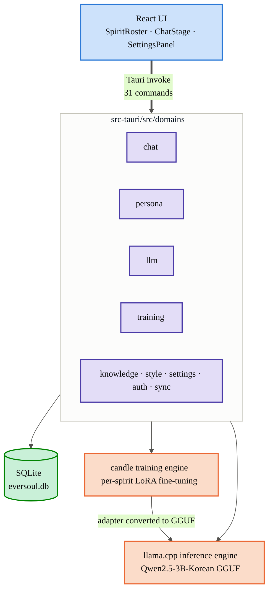
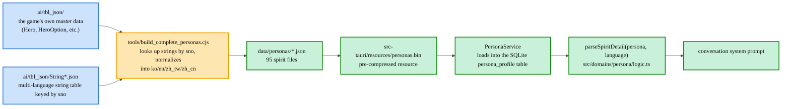
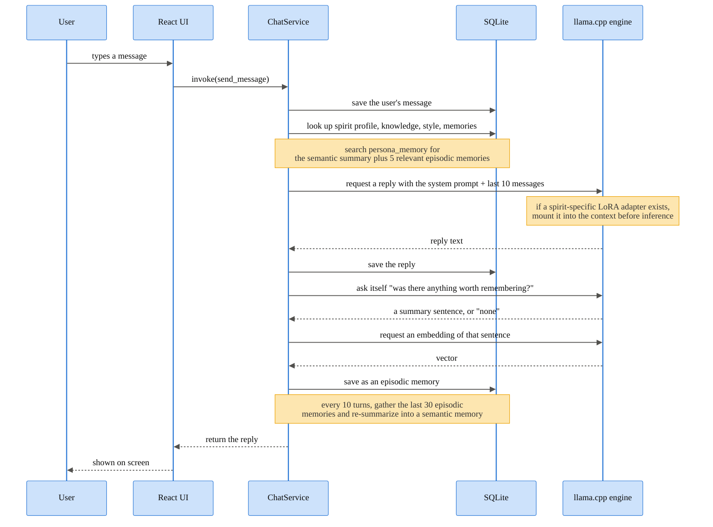
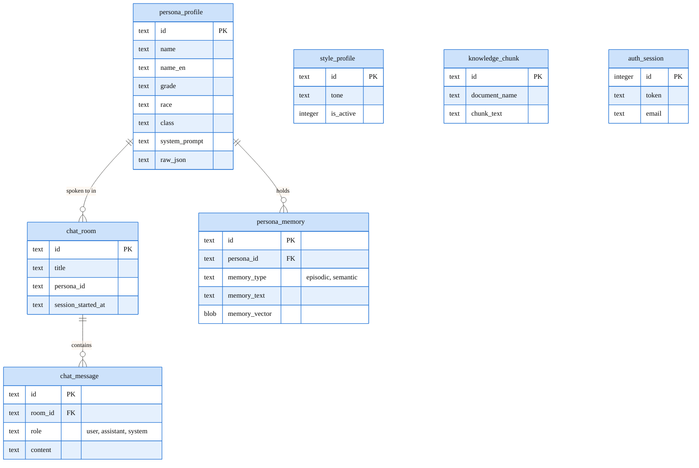
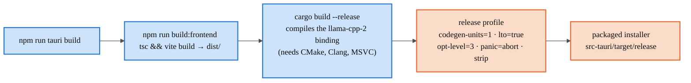

  <a href="ARCHITECTURE.md"> 한국어</a> &nbsp;|&nbsp;
   <strong>English</strong> &nbsp;|&nbsp;
  <a href="ARCHITECTURE.zh-CN.md"> 简体中文</a>

<h1 align="center">EverSoul AI Chat — Architecture</h1>

## 1. Overall System

## 2. How Spirit Data Is Made — from TBL source to the chat prompt

## 3. How One Turn of Conversation with a Spirit Is Handled

## 4. Per-Spirit LoRA Fine-Tuning Pipeline

```mermaid
%%{init: {'theme': 'base', 'themeVariables': {'primaryColor': '#cde2fb', 'primaryBorderColor': '#2a78d6', 'primaryTextColor': '#0b0b0b', 'lineColor': '#52514e', 'clusterBkg': '#fcfcfb', 'clusterBorder': '#c3c2b7', 'fontFamily': 'system-ui, -apple-system, Segoe UI, sans-serif'}}}%%
flowchart LR
    CHATDB[("SQLite<br/>chat_room · chat_message")]
    COLLECT["TrainingService::collect_training_examples<br/>walks that spirit's chat rooms and<br/>pairs each assistant reply with the history before it"]
    CONV["a list of ConversationExample<br/>(system_prompt, prompt_turns, target_reply)<br/>※ an in-memory Rust struct, not a JSON file"]
    BASE["base model<br/>safetensors + tokenizer<br/>(downloader::ensure_base_model_files)"]
    MODEL["Qwen2Model<br/>built from scratch with candle-core/candle-nn<br/>LoRA rank=8, alpha=16 built in"]
    OPT["AdamW optimizer<br/>lr=1e-4"]
    LOSS["Cross-Entropy Loss<br/>log_softmax + gather, with loss_mask applied"]
    SAVE["save LoRA weights<br/>safetensors"]
    EXPORT["convert to a GGUF adapter<br/>export_lora_to_gguf"]
    DEPLOY["lora_adapters/{persona_id}.gguf"]

    CHATDB --> COLLECT --> CONV --> MODEL
    BASE --> MODEL
    MODEL --> LOSS --> OPT --> MODEL
    OPT --> SAVE --> EXPORT --> DEPLOY

    classDef data fill:#cde2fb,stroke:#2a78d6,stroke-width:2px,color:#0b0b0b
    classDef train fill:#e3ddf7,stroke:#4a3aa7,stroke-width:2px,color:#0b0b0b
    classDef out fill:#fbdcc9,stroke:#eb6834,stroke-width:2px,color:#0b0b0b

    class CHATDB,COLLECT,CONV,BASE data
    class MODEL,OPT,LOSS,SAVE train
    class EXPORT,DEPLOY out
```

## 5. Local Database Structure

## 6. Build Pipeline

