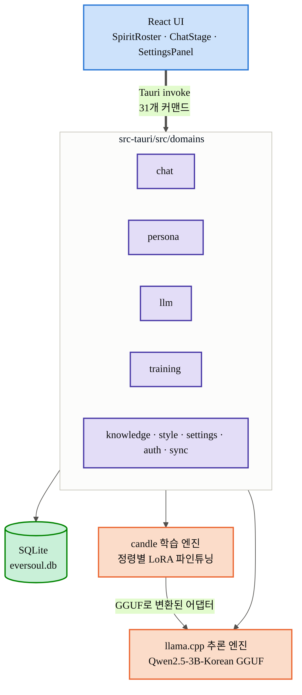
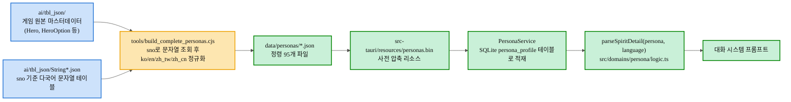
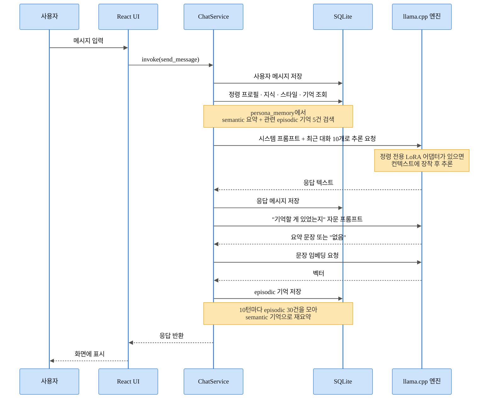
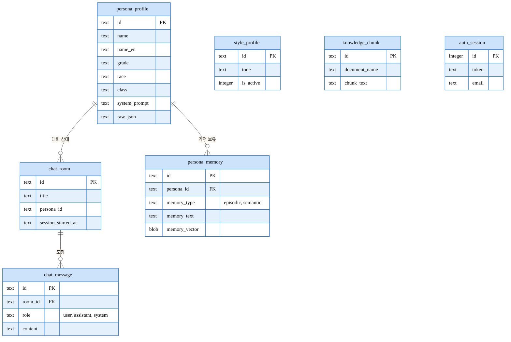
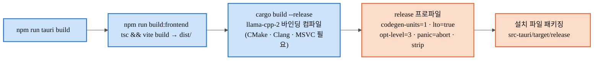

   <strong>한국어</strong> &nbsp;|&nbsp;
  <a href="ARCHITECTURE.en.md"> English</a> &nbsp;|&nbsp;
  <a href="ARCHITECTURE.zh-CN.md"> 简体中文</a>

<h1 align="center">EverSoul AI Chat — 아키텍처</h1>

## 1. 전체 시스템

## 2. 정령 데이터가 만들어지는 과정 — TBL 원본 → 대화 프롬프트

## 3. 정령과 나눈 대화 한 턴이 처리되는 순서

## 4. 정령별 LoRA 파인튜닝 파이프라인

```mermaid
%%{init: {'theme': 'base', 'themeVariables': {'primaryColor': '#cde2fb', 'primaryBorderColor': '#2a78d6', 'primaryTextColor': '#0b0b0b', 'lineColor': '#52514e', 'clusterBkg': '#fcfcfb', 'clusterBorder': '#c3c2b7', 'fontFamily': 'system-ui, -apple-system, Segoe UI, sans-serif'}}}%%
flowchart LR
    CHATDB[("SQLite<br/>chat_room · chat_message")]
    COLLECT["TrainingService::collect_training_examples<br/>정령별 대화방을 순회하며<br/>assistant 메시지마다 그 이전 대화 이력을 묶음"]
    CONV["ConversationExample 목록<br/>(system_prompt, prompt_turns, target_reply)<br/>※ JSON 파일이 아니라 메모리상의 Rust 구조체"]
    BASE["베이스 모델<br/>safetensors + tokenizer<br/>(downloader::ensure_base_model_files)"]
    MODEL["Qwen2Model<br/>candle-core/candle-nn로 직접 구현<br/>LoRA rank=8, alpha=16 내장"]
    OPT["AdamW 옵티마이저<br/>lr=1e-4"]
    LOSS["Cross-Entropy Loss<br/>log_softmax + gather, loss_mask 적용"]
    SAVE["LoRA 가중치 저장<br/>safetensors"]
    EXPORT["GGUF 어댑터로 변환<br/>export_lora_to_gguf"]
    DEPLOY["lora_adapters/{persona_id}.gguf"]

    CHATDB --> COLLECT --> CONV --> MODEL
    BASE --> MODEL
    MODEL --> LOSS --> OPT --> MODEL
    OPT --> SAVE --> EXPORT --> DEPLOY

    classDef data fill:#cde2fb,stroke:#2a78d6,stroke-width:2px,color:#0b0b0b
    classDef train fill:#e3ddf7,stroke:#4a3aa7,stroke-width:2px,color:#0b0b0b
    classDef out fill:#fbdcc9,stroke:#eb6834,stroke-width:2px,color:#0b0b0b

    class CHATDB,COLLECT,CONV,BASE data
    class MODEL,OPT,LOSS,SAVE train
    class EXPORT,DEPLOY out
```

## 5. 로컬 데이터베이스 구조

## 6. 빌드 파이프라인

