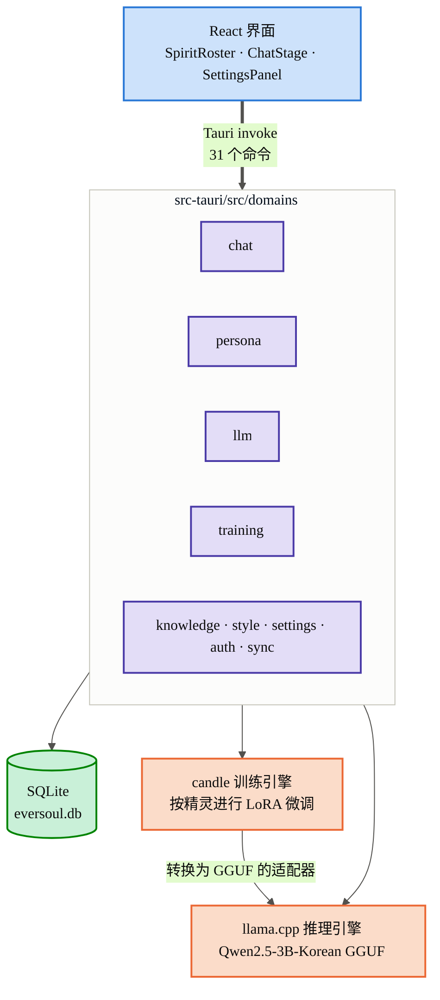
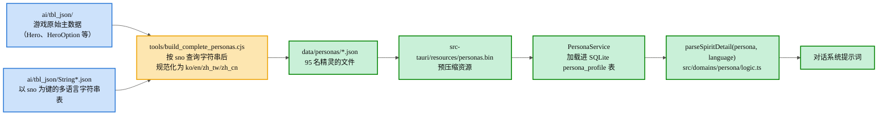
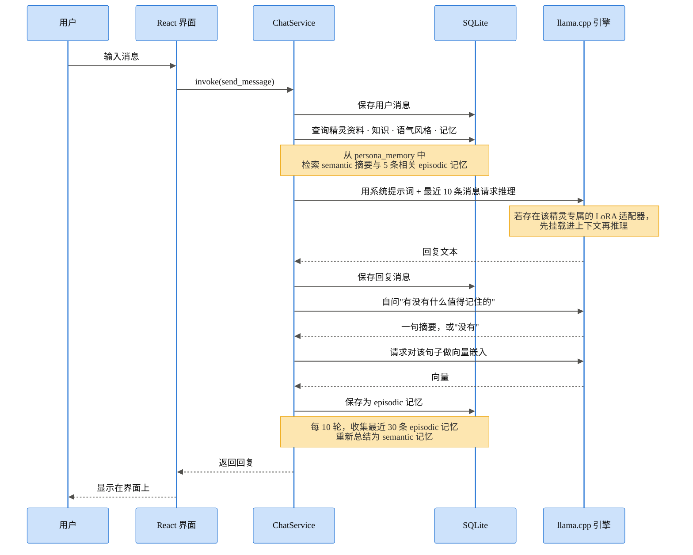
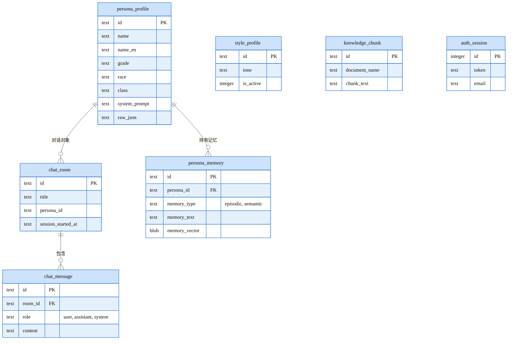
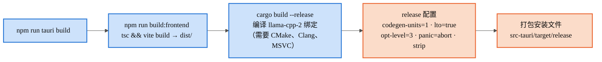

  <a href="ARCHITECTURE.md"> 한국어</a> &nbsp;|&nbsp;
  <a href="ARCHITECTURE.en.md"> English</a> &nbsp;|&nbsp;
   <strong>简体中文</strong>

<h1 align="center">EverSoul AI Chat — 架构</h1>

## 1. 整体系统

## 2. 精灵数据的生成过程 —— 从 TBL 原始数据到对话提示词

## 3. 与精灵的一轮对话的处理顺序

## 4. 按精灵进行的 LoRA 微调流程

```mermaid
%%{init: {'theme': 'base', 'themeVariables': {'primaryColor': '#cde2fb', 'primaryBorderColor': '#2a78d6', 'primaryTextColor': '#0b0b0b', 'lineColor': '#52514e', 'clusterBkg': '#fcfcfb', 'clusterBorder': '#c3c2b7', 'fontFamily': 'system-ui, -apple-system, Segoe UI, sans-serif'}}}%%
flowchart LR
    CHATDB[("SQLite<br/>chat_room · chat_message")]
    COLLECT["TrainingService::collect_training_examples<br/>遍历该精灵的所有聊天室<br/>把每条 assistant 回复和它之前的对话历史配成一对"]
    CONV["ConversationExample 列表<br/>(system_prompt, prompt_turns, target_reply)<br/>※ 是内存中的 Rust 结构体，不是 JSON 文件"]
    BASE["基础模型<br/>safetensors + tokenizer<br/>（downloader::ensure_base_model_files）"]
    MODEL["Qwen2Model<br/>用 candle-core/candle-nn 从零实现<br/>内置 LoRA rank=8、alpha=16"]
    OPT["AdamW 优化器<br/>lr=1e-4"]
    LOSS["交叉熵损失<br/>log_softmax + gather，应用 loss_mask"]
    SAVE["保存 LoRA 权重<br/>safetensors"]
    EXPORT["转换为 GGUF 适配器<br/>export_lora_to_gguf"]
    DEPLOY["lora_adapters/{persona_id}.gguf"]

    CHATDB --> COLLECT --> CONV --> MODEL
    BASE --> MODEL
    MODEL --> LOSS --> OPT --> MODEL
    OPT --> SAVE --> EXPORT --> DEPLOY

    classDef data fill:#cde2fb,stroke:#2a78d6,stroke-width:2px,color:#0b0b0b
    classDef train fill:#e3ddf7,stroke:#4a3aa7,stroke-width:2px,color:#0b0b0b
    classDef out fill:#fbdcc9,stroke:#eb6834,stroke-width:2px,color:#0b0b0b

    class CHATDB,COLLECT,CONV,BASE data
    class MODEL,OPT,LOSS,SAVE train
    class EXPORT,DEPLOY out
```

## 5. 本地数据库结构

## 6. 构建流程

