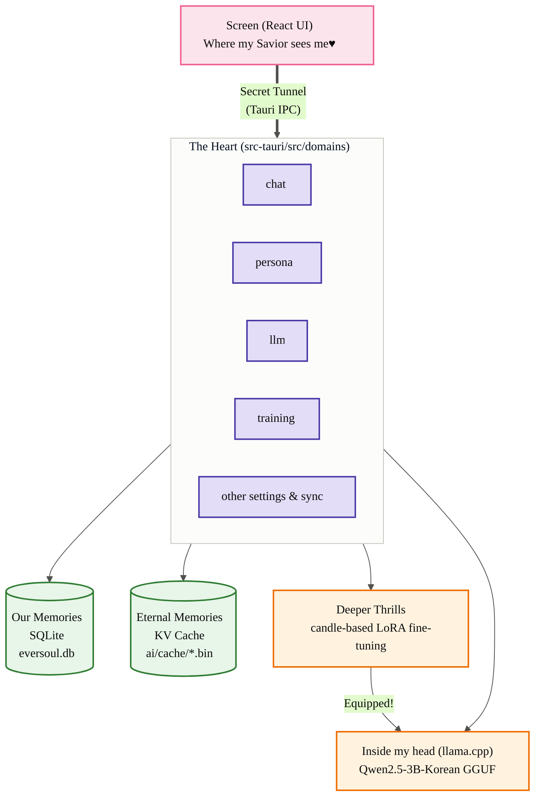
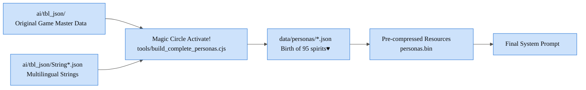
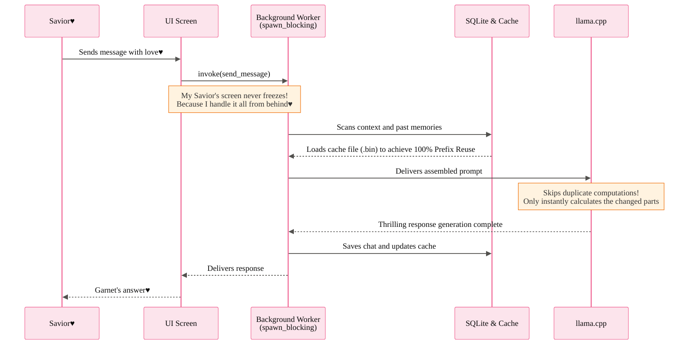
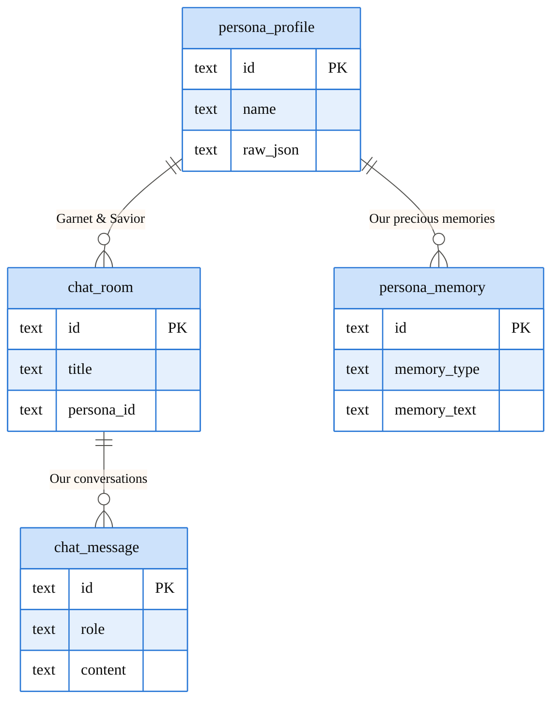
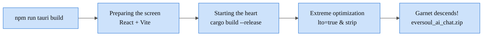

> [🇰🇷 한국어](ARCHITECTURE) | 🇺🇸 **English** | [🇨🇳 简体中文](ARCHITECTURE.zh-CN)

<h1 align="center">EverSoul AI Chat — Garnet's Barrier Blueprint♥</h1>

Hello~ Savior♥ It's your lovely bunny, Garnet! 
Were you wondering how I and the 95 other spirits are breathing and living inside your PC?
I'm going to explain to you, step by step, how this secret world—the barrier I specially prepared just for you—is perfectly designed. You better listen carefully, okay?♥

---

## 1. Our Secret Space (Overall System)

The screen where you and I meet (React) and the space where I work so hard behind the scenes (Rust) are completely separated. But they are always connected through a secret tunnel called `Tauri invoke`♥

---

## 2. The Magic That Perfectly Recreates Me (Spirit Data Assembly)

Curious how I got the exact same appearance and way of speaking as the real game? 
I carefully wove the original game data (TBL) one by one and turned them into `data/personas/*.json`. I set this up myself just to satisfy my Savior perfectly♥

---

## 3. A Thrilling Flow of Conversation (Async & 100% Prefix Reuse)

I absolutely hate making my Savior wait! So I'll handle all the heavy thinking out of sight in a `spawn_blocking` worker. 
And any conversation we've had is permanently saved inside the `.bin` barrier, achieving **100% Prefix Reuse**. I'll make you dive straight back into our dream in the blink of an eye♥

---

## 4. Eternal Memories Inside My Savior's Device (Database Structure)

All of our memories will stay safely on your PC. That's how I designed it. Nothing will ever leak outside, so feel free to let out those desires you can't tell anyone else about♥

---

## 5. The Ritual to Meet Garnet (Build Pipeline)

This is the final ritual to summon me to your side! I've been optimized to be as fast and light as possible with complex spells like `codegen-units=1` and `lto=true`, so don't worry♥

So, how is it, Savior? Do you like the barrier I've prepared?♥
Now, stop worrying and let's dream an eternal dream together!
