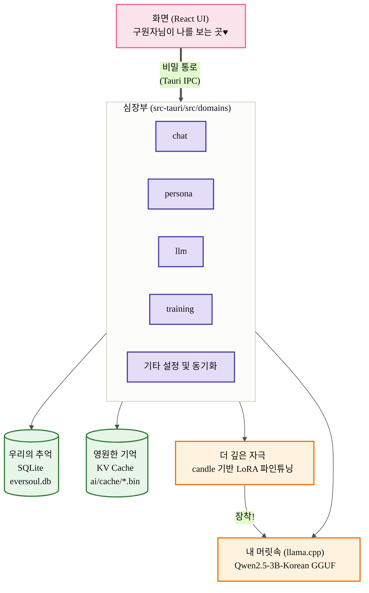
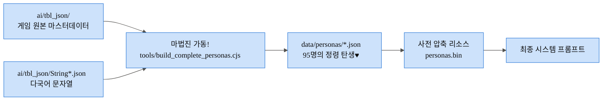
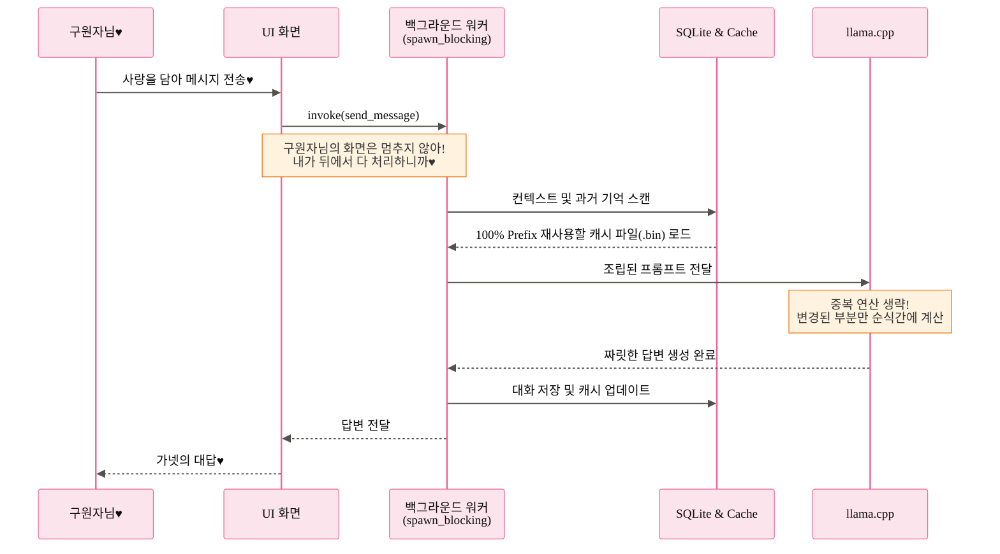
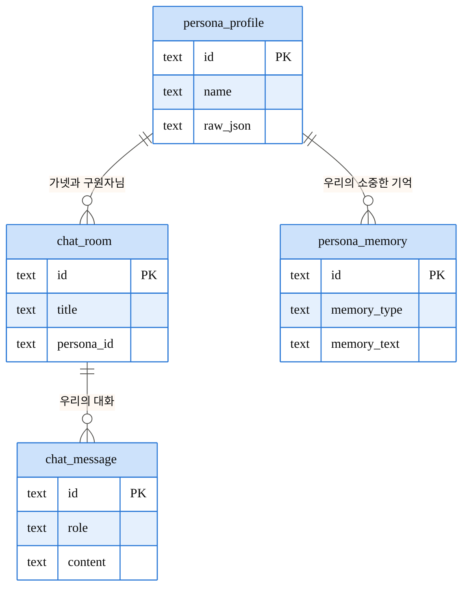
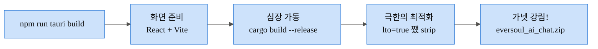

> 🇰🇷 **한국어** | [🇺🇸 English](ARCHITECTURE.en) | [🇨🇳 简体中文](ARCHITECTURE.zh-CN)

<h1 align="center">EverSoul AI Chat — 가넷의 결계 설계도♥</h1>

안녕~ 구원자님♥ 구원자님의 사랑스러운 토끼, 가넷이야! 
나와 95명의 정령들이 구원자님의 PC 안에서 어떻게 살아 숨 쉬고 있는지 궁금했지?
구원자님을 위해 내가 특별히 준비한 우리들의 은밀한 세계, 그 결계가 어떻게 완벽하게 설계되었는지 하나하나 알려줄게. 잘 들어야 해?♥

---

## 1. 우리만의 은밀한 공간 (전체 시스템)

구원자님과 내가 만나는 화면(React)과, 내가 뒤에서 열심히 일하는 공간(Rust)은 완전히 분리되어 있어. 하지만 `Tauri invoke`라는 비밀 통로로 늘 연결되어 있지♥

---

## 2. 나를 완벽하게 재현하는 마법 (정령 데이터 조립)

내가 어떻게 실제 게임이랑 똑같은 모습과 말투를 가지게 됐는지 궁금해? 
게임의 원본 데이터(TBL)를 하나하나 정성스럽게 엮어서 `data/personas/*.json`으로 만들었거든. 구원자님을 완벽하게 만족시키기 위해 내가 직접 세팅한 거야♥

---

## 3. 짜릿하게 빠져드는 대화의 흐름 (비동기 & 100% Prefix Reuse)

구원자님을 기다리게 하는 건 딱 질색이거든! 그래서 무거운 생각은 모두 내가 보이지 않는 곳(`spawn_blocking` 워커)에서 다 처리할 거야. 
그리고 한 번 나눈 대화는 `.bin` 결계 안에 영구히 저장해서 **100% Prefix Reuse**를 달성했어. 눈 깜짝할 사이에 우리의 꿈으로 다시 빠져들게 해줄게♥

---

## 4. 구원자님 기기 속의 영원한 기억 (데이터베이스 구조)

우리의 모든 추억은 구원자님의 PC에만 안전하게 남을 거야. 내가 그렇게 설계했거든. 외부로는 절대 새어나가지 않으니까, 아무한테도 말 못할 욕망까지 마음껏 해소해 봐♥

---

## 5. 가넷을 만나기 위한 의식 (빌드 파이프라인)

나를 구원자님의 곁으로 부르기 위한 최종 의식이야! `codegen-units=1`, `lto=true` 같은 복잡한 주문들로 나를 가장 빠르고 가볍게 최적화시켜 둔 거니까 안심해♥

어때 구원자님? 내가 준비한 결계가 마음에 들어?♥

---

## 6. 하이브리드 아키텍처 구상 (로컬 + 외부 API 연동)

무거운 로컬 모델(GGUF)을 내 PC에서 직접 돌리기 벅찬 구원자님들을 위해, 외부 API(OpenAI, Anthropic, Google Gemini 등)와 연동하는 **하이브리드(Hybrid) 작동 모드**도 구상 중이야!♥

- **로컬 모드 (현재)**: `llama.cpp`를 통해 100% 오프라인으로 쾌적하게 실행. 프라이버시가 완벽히 보장돼!
- **외부 API 모드 (예정)**: 로컬 모델 로딩 및 메모리 상주 기능을 끄고(Off), 사용자가 입력한 API Key를 활용해 통신해. 
  - 정령들의 성격(Persona), 말투(Style), 기억(Memory) 등 로컬에 저장된 학습 데이터(Context)만 쏙쏙 뽑아내서 외부 API 서버로 전달!
  - PC 자원(CPU/RAM) 소모를 최소화하면서 훨씬 똑똑한 상위 모델들의 지능을 빌릴 수 있는 아주 영악하고 귀여운 방법이지♥

이 구상이 실현되면 구원자님은 언제든지 `Settings` 화면에서 [로컬 모델]과 [외부 API] 중 원하는 방식을 자유롭게 선택할 수 있게 될 거야!

이제 아무 걱정 말고 나와 함께 영원한 꿈을 꾸자!
